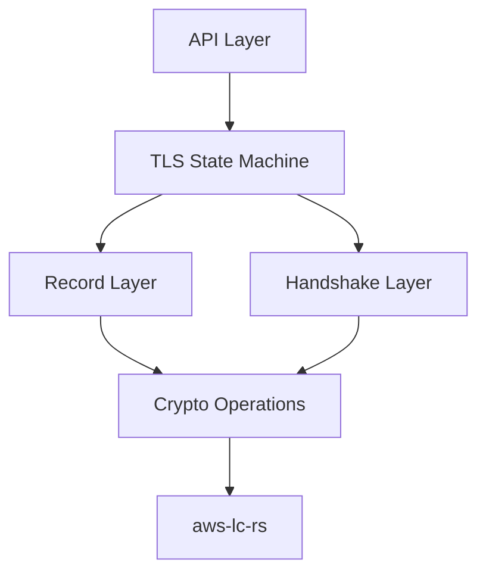
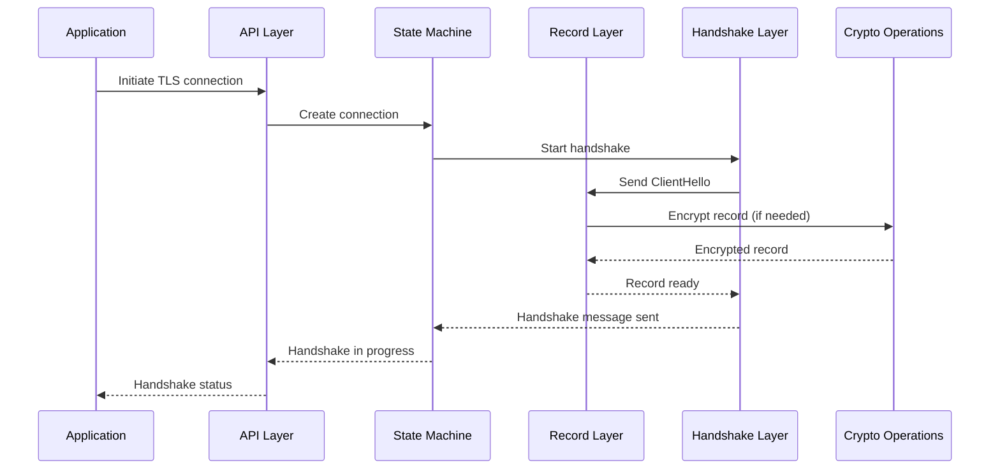

# Design Document: Rust TLS Implementation

## Overview

This document outlines the design for a Rust implementation of the TLS protocol that is compatible with s2n-tls. The implementation will focus exclusively on TLS 1.3 as specified in RFC 8446. The design prioritizes memory safety, performance, and interoperability with the existing s2n-tls C implementation.

The Rust implementation will leverage Rust's safety guarantees while maintaining the same performance characteristics as the C version. It will use aws-lc-rs for cryptographic operations and follow idiomatic Rust patterns to ensure code quality and maintainability.

## Architecture

The architecture of the Rust TLS implementation will follow a modular design that separates concerns and allows for easy testing and maintenance. The high-level architecture consists of the following components:

### Core Components



1. **API Layer**: Provides a clean, idiomatic Rust API for applications to use the TLS implementation. This layer will offer blocking versions of core functions.

2. **TLS State Machine**: Manages the TLS protocol state transitions and ensures that operations are performed in the correct sequence.

3. **Record Layer**: Handles the TLS record protocol, including record framing, encryption, and decryption.

4. **Handshake Layer**: Manages the TLS handshake protocol, including message parsing, validation, and generation.

5. **Crypto Operations**: Provides an abstraction over cryptographic operations required by the TLS protocol.

6. **aws-lc-rs Integration**: Interfaces with the aws-lc-rs library for cryptographic operations.

### Data Flow



## Components and Interfaces

### API Layer

The API layer will provide a clean, idiomatic Rust interface for applications to use the TLS implementation. The API design will follow the [Rust API Guidelines](https://rust-lang.github.io/api-guidelines/) to ensure consistency, ergonomics, and proper documentation. It will include:

```rust
/// A TLS connection
pub struct Connection {
    // Internal state
}

impl Connection {
    /// Create a new TLS connection in client mode
    pub fn new_client() -> Result<Self, Error>;
    
    /// Create a new TLS connection in server mode
    pub fn new_server() -> Result<Self, Error>;
    
    /// Set the file descriptor for I/O operations
    pub fn set_fd(&mut self, fd: RawFd) -> Result<(), Error>;
    
    /// Negotiate the TLS handshake
    pub fn negotiate(&mut self) -> Result<BlockedStatus, Error>;
    
    /// Send data over the TLS connection
    pub fn send(&mut self, data: &[u8]) -> Result<usize, Error>;
    
    /// Receive data from the TLS connection
    pub fn recv(&mut self, data: &mut [u8]) -> Result<usize, Error>;
    
    /// Close the TLS connection
    pub fn shutdown(&mut self) -> Result<BlockedStatus, Error>;
}

/// Configuration for TLS connections
pub struct Config {
    // Internal state
}

impl Config {
    /// Create a new TLS configuration
    pub fn new() -> Result<Self, Error>;
    
    /// Set the certificate chain
    pub fn set_certificate_chain(&mut self, chain: &[u8]) -> Result<(), Error>;
    
    /// Set the private key
    pub fn set_private_key(&mut self, key: &[u8]) -> Result<(), Error>;
    
    /// Set the security policy
    pub fn set_security_policy(&mut self, policy: SecurityPolicy) -> Result<(), Error>;
    
    /// Add a trusted certificate authority
    pub fn add_trusted_ca(&mut self, ca: &[u8]) -> Result<(), Error>;
}

// Note: Async API support has been removed for now to focus on the core functionality
```

### TLS State Machine

The TLS state machine will manage the TLS protocol state transitions and ensure that operations are performed in the correct sequence. It will be implemented using a state pattern with explicit state transitions:

```rust
enum ConnectionState {
    Initial,
    ClientHelloSent,
    ServerHelloReceived,
    // ... other states
    Established,
    Closing,
    Closed,
}

struct StateMachine {
    state: ConnectionState,
    // ... other fields
}

impl StateMachine {
    fn transition(&mut self, event: Event) -> Result<(), Error> {
        // Handle state transitions based on events
    }
}
```

### Record Layer

The record layer will handle the TLS record protocol, including record framing, encryption, and decryption:

```rust
struct RecordLayer {
    // ... fields
}

/// IoProvider trait for abstracting I/O operations
trait IoProvider {
    /// Read data from the underlying I/O source
    fn read(&mut self, buf: &mut [u8]) -> Result<usize, std::io::Error>;
    
    /// Write data to the underlying I/O sink
    fn write(&mut self, buf: &[u8]) -> Result<usize, std::io::Error>;
}

/// Implementation of IoProvider for file descriptors
struct FdIoProvider {
    fd: RawFd,
}

impl IoProvider for FdIoProvider {
    fn read(&mut self, buf: &mut [u8]) -> Result<usize, std::io::Error> {
        // Read from file descriptor
        unimplemented!()
    }
    
    fn write(&mut self, buf: &[u8]) -> Result<usize, std::io::Error> {
        // Write to file descriptor
        unimplemented!()
    }
}

/// Implementation of IoProvider for Rust's Read + Write traits
struct RwIoProvider<T: Read + Write> {
    io: T,
}

impl<T: Read + Write> IoProvider for RwIoProvider<T> {
    fn read(&mut self, buf: &mut [u8]) -> Result<usize, std::io::Error> {
        self.io.read(buf)
    }
    
    fn write(&mut self, buf: &[u8]) -> Result<usize, std::io::Error> {
        self.io.write(buf)
    }
}

impl RecordLayer {
    fn read_record(&mut self, io: &mut dyn IoProvider) -> Result<Record, Error>;
    fn write_record(&mut self, record: Record, io: &mut dyn IoProvider) -> Result<usize, Error>;
    fn encrypt_record(&mut self, record: &mut Record) -> Result<(), Error>;
    fn decrypt_record(&mut self, record: &mut Record) -> Result<(), Error>;
}

struct Record {
    record_type: RecordType,
    version: ProtocolVersion,
    payload: Vec<u8>,
}

enum RecordType {
    Handshake,
    ChangeCipherSpec,
    Alert,
    ApplicationData,
}
```

### Handshake Layer

The handshake layer will manage the TLS handshake protocol, including message parsing, validation, and generation:

```rust
struct HandshakeLayer {
    // ... fields
}

impl HandshakeLayer {
    fn process_handshake_message(&mut self, message: HandshakeMessage) -> Result<Vec<HandshakeMessage>, Error>;
    fn create_client_hello(&self) -> Result<HandshakeMessage, Error>;
    fn process_server_hello(&mut self, message: &HandshakeMessage) -> Result<(), Error>;
    // ... other methods for handling handshake messages
}

enum HandshakeMessage {
    ClientHello(ClientHello),
    ServerHello(ServerHello),
    // ... other handshake message types
}

struct ClientHello {
    // ... fields
}

struct ServerHello {
    // ... fields
}
```

### Crypto Operations

The crypto operations component will provide an abstraction over cryptographic operations required by the TLS protocol:

```rust
struct CryptoContext {
    // ... fields
}

impl CryptoContext {
    fn new() -> Result<Self, Error>;
    fn generate_key_share(&self, group: NamedGroup) -> Result<KeyShare, Error>;
    fn derive_handshake_secrets(&mut self, shared_secret: &[u8]) -> Result<(), Error>;
    fn derive_application_secrets(&mut self) -> Result<(), Error>;
    fn encrypt(&self, plaintext: &[u8], aad: &[u8], nonce: &[u8]) -> Result<Vec<u8>, Error>;
    fn decrypt(&self, ciphertext: &[u8], aad: &[u8], nonce: &[u8]) -> Result<Vec<u8>, Error>;
    // ... other crypto operations
}
```

### aws-lc-rs Integration

The aws-lc-rs integration will interface with the aws-lc-rs library for cryptographic operations:

```rust
struct AwsLcCrypto {
    // ... fields
}

impl AwsLcCrypto {
    fn new() -> Result<Self, Error>;
    fn hash(&self, algorithm: HashAlgorithm, data: &[u8]) -> Result<Vec<u8>, Error>;
    fn hmac(&self, algorithm: HashAlgorithm, key: &[u8], data: &[u8]) -> Result<Vec<u8>, Error>;
    fn aead_encrypt(&self, algorithm: AeadAlgorithm, key: &[u8], iv: &[u8], aad: &[u8], plaintext: &[u8]) -> Result<Vec<u8>, Error>;
    fn aead_decrypt(&self, algorithm: AeadAlgorithm, key: &[u8], iv: &[u8], aad: &[u8], ciphertext: &[u8]) -> Result<Vec<u8>, Error>;
    // ... other crypto operations
}
```

## Data Models

### TLS Connection

The TLS connection data model will represent the state of a TLS connection:

```rust
struct Connection {
    config: Arc<Config>,
    state_machine: StateMachine,
    record_layer: RecordLayer,
    handshake_layer: HandshakeLayer,
    crypto_context: CryptoContext,
    io_provider: Box<dyn IoProvider>,
    mode: ConnectionMode,
    blocked_status: BlockedStatus,
    // ... other fields
}

enum ConnectionMode {
    Client,
    Server,
}

enum BlockedStatus {
    NotBlocked,
    BlockedOnRead,
    BlockedOnWrite,
}
```

### TLS Configuration

The TLS configuration data model will represent the configuration of a TLS connection:

```rust
struct Config {
    certificate_chain: Option<Vec<u8>>,
    private_key: Option<Vec<u8>>,
    security_policy: SecurityPolicy,
    trusted_cas: Vec<Vec<u8>>,
    // ... other fields
}

struct SecurityPolicy {
    cipher_suites: Vec<CipherSuite>,
    signature_algorithms: Vec<SignatureAlgorithm>,
    named_groups: Vec<NamedGroup>,
    min_protocol_version: ProtocolVersion,
    max_protocol_version: ProtocolVersion,
    is_fips_compliant: bool,
    // ... other fields
}

/// Builder for SecurityPolicy
struct SecurityPolicyBuilder {
    min_protocol_version: Option<ProtocolVersion>,
    max_protocol_version: Option<ProtocolVersion>,
    is_fips_compliant: bool,
    // ... other fields
}

impl SecurityPolicyBuilder {
    /// Create a new SecurityPolicyBuilder with default settings
    pub fn new() -> Self {
        Self {
            min_protocol_version: None,
            max_protocol_version: None,
            is_fips_compliant: false,
        }
    }
    
    /// Set the minimum protocol version
    pub fn min_protocol_version(mut self, version: ProtocolVersion) -> Self {
        self.min_protocol_version = Some(version);
        self
    }
    
    /// Set the maximum protocol version
    pub fn max_protocol_version(mut self, version: ProtocolVersion) -> Self {
        self.max_protocol_version = Some(version);
        self
    }
    
    /// Set whether to use FIPS compliant ciphers
    pub fn fips_compliant(mut self, is_fips_compliant: bool) -> Self {
        self.is_fips_compliant = is_fips_compliant;
        self
    }
    
    /// Build the SecurityPolicy
    pub fn build(self) -> Result<SecurityPolicy, Error> {
        // Determine appropriate cipher suites, signature algorithms, etc.
        // based on the builder settings
        
        let min_version = self.min_protocol_version.unwrap_or(ProtocolVersion { major: 3, minor: 3 }); // TLS 1.2
        let max_version = self.max_protocol_version.unwrap_or(ProtocolVersion { major: 3, minor: 4 }); // TLS 1.3
        
        // Select appropriate cipher suites based on FIPS compliance and protocol versions
        let cipher_suites = if self.is_fips_compliant {
            // FIPS compliant cipher suites
            vec![/* FIPS compliant cipher suites */]
        } else {
            // Default cipher suites
            vec![/* Default cipher suites */]
        };
        
        // Select appropriate signature algorithms
        let signature_algorithms = vec![/* Appropriate signature algorithms */];
        
        // Select appropriate named groups
        let named_groups = vec![/* Appropriate named groups */];
        
        Ok(SecurityPolicy {
            cipher_suites,
            signature_algorithms,
            named_groups,
            min_protocol_version: min_version,
            max_protocol_version: max_version,
            is_fips_compliant: self.is_fips_compliant,
        })
    }
}
```

### TLS Records

The TLS record data model will represent a TLS record:

```rust
struct Record {
    record_type: RecordType,
    version: ProtocolVersion,
    payload: Vec<u8>,
}

enum RecordType {
    Handshake,
    ChangeCipherSpec,
    Alert,
    ApplicationData,
}

struct ProtocolVersion {
    major: u8,
    minor: u8,
}
```

### TLS Handshake Messages

The TLS handshake message data models will represent the various TLS handshake messages:

```rust
enum HandshakeMessage {
    ClientHello(ClientHello),
    ServerHello(ServerHello),
    EncryptedExtensions(EncryptedExtensions),
    Certificate(Certificate),
    CertificateVerify(CertificateVerify),
    Finished(Finished),
    // ... other handshake message types
}

struct ClientHello {
    legacy_version: ProtocolVersion,
    random: [u8; 32],
    legacy_session_id: Vec<u8>,
    cipher_suites: Vec<CipherSuite>,
    legacy_compression_methods: Vec<u8>,
    extensions: Vec<Extension>,
}

struct ServerHello {
    legacy_version: ProtocolVersion,
    random: [u8; 32],
    legacy_session_id_echo: Vec<u8>,
    cipher_suite: CipherSuite,
    legacy_compression_method: u8,
    extensions: Vec<Extension>,
}

// ... other handshake message structs
```

## Error Handling

The error handling strategy will use Rust's Result type with custom error types defined using the thiserror crate:

```rust
#[derive(Debug, thiserror::Error)]
pub enum Error {
    #[error("I/O error: {0}")]
    Io(#[from] std::io::Error),
    
    #[error("TLS protocol error: {0}")]
    Protocol(#[from] ProtocolError),
    
    #[error("Crypto error: {0}")]
    Crypto(#[from] CryptoError),
    
    #[error("Configuration error: {0}")]
    Config(#[from] ConfigError),
    
    // ... other error types
}

#[derive(Debug, thiserror::Error)]
pub enum ProtocolError {
    #[error("Unexpected message: expected {expected:?}, got {actual:?}")]
    UnexpectedMessage {
        expected: HandshakeType,
        actual: HandshakeType,
    },
    
    #[error("Invalid record type: {0}")]
    InvalidRecordType(u8),
    
    #[error("Protocol version not supported: {0:?}")]
    UnsupportedVersion(ProtocolVersion),
    
    // ... other protocol errors
}

// ... other error enums
```

## Memory Safety and API Design Principles

The memory safety strategy will leverage Rust's ownership and borrowing system to prevent memory-related vulnerabilities:

1. **Zero-Copy Parsing**: Use the zerocopy crate for zero-cost memory manipulation.
2. **Bounds Checking**: Rely on Rust's built-in bounds checking for array and slice access.
3. **No Unsafe Code**: Avoid using unsafe code whenever possible.
4. **Resource Management**: Use RAII (Resource Acquisition Is Initialization) for resource management.
5. **Error Handling**: Use Result for error propagation instead of error codes.

### API Design Principles

The implementation will follow the [Rust API Guidelines](https://rust-lang.github.io/api-guidelines/) for all public APIs. Key principles include:

1. **Predictability**: APIs should be predictable and easy to use correctly.
2. **Flexibility**: APIs should be flexible and composable.
3. **Ergonomics**: APIs should be ergonomic and intuitive.
4. **Documentation**: All public APIs should be well-documented with examples.

Specific guidelines that will be followed include:

- **Naming**: Use consistent naming conventions (e.g., methods that return `Option` should be named `find_*` or `*_opt`).
- **Error Handling**: Use the `thiserror` crate for defining error types and implement appropriate traits.
- **Documentation**: Include examples in documentation and ensure all public items are documented.
- **Versioning**: Follow semantic versioning for all public APIs.
- **Type Safety**: Use Rust's type system to prevent misuse of the API.
- **Builders**: Use the builder pattern for complex object construction.
- **Iterators**: Implement standard iterator traits where appropriate.
- **Traits**: Use traits to define behavior and provide extension points.

During implementation, we will regularly refer to the API Guidelines to ensure compliance.

## Testing Strategy

The testing strategy will include:

1. **Unit Tests**: Each component will have unit tests with high coverage.
2. **Integration Tests**: Test the interaction between components.
3. **Interoperability Tests**: Test interoperability with s2n-tls and other TLS implementations.
4. **Fuzz Testing**: Use differential fuzzing to ensure equivalence with s2n-tls.
5. **Benchmarks**: Measure performance against s2n-tls.
6. **Snapshot Tests**: Use the insta crate to assert complex output remains consistent with expected reference values.
7. **Property Tests**: Use the Bolero property-testing framework to assert that specific properties of functions and components are upheld under a variety of inputs. This will be integrated with the Kani Rust Verifier for formal verification.
8. **Compliance Testing**: Annotate code with inline references to requirements in IETF RFC specifications. Use Duvet to generate a compliance report, making it easy to track compliance with each requirement.
9. **Static Analysis**:
   - Use clippy to catch common mistakes and enforce Rust best practices.
   - Use rustfmt to ensure code is consistently formatted.
   - Use cargo-deny to check for problematic dependencies.

### Property Testing with Bolero and Kani

The implementation will use Bolero for property testing, which can be integrated with multiple fuzzing engines as well as the Kani Rust Verifier. This approach allows us to:

1. Define properties that should hold for all inputs
2. Generate random inputs to test these properties
3. Use formal verification to prove properties hold for all possible inputs

For example, we can define properties like:

```rust
#[test]
fn test_record_roundtrip() {
    bolero::check!().with_type::<Record>().for_each(|record| {
        let mut buffer = Vec::new();
        record.encode(&mut buffer).unwrap();
        
        let decoded = Record::decode(&buffer).unwrap();
        assert_eq!(record, &decoded);
    });
}
```

### Compliance Testing with Duvet

The implementation will use Duvet to track compliance with TLS specifications. Code will be annotated with references to specific requirements in the RFCs:

```rust
//= https://tools.ietf.org/html/rfc8446#section-4.1.2
//# struct {
//#   ProtocolVersion legacy_version = 0x0303;    /* TLS v1.2 */
//#   Random random;
//#   opaque legacy_session_id<0..32>;
//#   CipherSuite cipher_suites<2..2^16-2>;
//#   opaque legacy_compression_methods<1..2^8-1>;
//#   Extension extensions<8..2^16-1>;
//# } ClientHello;
fn parse_client_hello(buf: &[u8]) -> Result<ClientHello, Error> {
    // Implementation
}
```

Duvet will generate a report showing which requirements have been implemented and which are still pending.

## Demo Application

A demo application will be created to demonstrate the functionality of the Rust TLS implementation:

```rust
fn main() -> Result<(), Box<dyn std::error::Error>> {
    // Parse command-line arguments
    let args = std::env::args().collect::<Vec<_>>();
    if args.len() < 2 {
        println!("Usage: {} [client|server] [options]", args[0]);
        return Ok(());
    }
    
    match args[1].as_str() {
        "client" => run_client(&args[2..])?,
        "server" => run_server(&args[2..])?,
        _ => {
            println!("Unknown mode: {}", args[1]);
            println!("Usage: {} [client|server] [options]", args[0]);
        }
    }
    
    Ok(())
}

fn run_client(args: &[String]) -> Result<(), Box<dyn std::error::Error>> {
    // Create a TLS client connection
    let mut config = Config::new()?;
    // ... configure the client
    
    let mut conn = Connection::new_client()?;
    conn.set_config(Arc::new(config))?;
    
    // Connect to the server
    let socket = TcpStream::connect("127.0.0.1:8443")?;
    conn.set_fd(socket.as_raw_fd())?;
    
    // Perform the TLS handshake
    let mut blocked = BlockedStatus::NotBlocked;
    while let Err(e) = conn.negotiate() {
        if let Error::Io(ref io_err) = e {
            if io_err.kind() == std::io::ErrorKind::WouldBlock {
                // Handle blocking I/O
                blocked = if blocked == BlockedStatus::BlockedOnRead {
                    BlockedStatus::BlockedOnWrite
                } else {
                    BlockedStatus::BlockedOnRead
                };
                continue;
            }
        }
        return Err(e.into());
    }
    
    // Send and receive data
    conn.send(b"Hello, server!")?;
    let mut buf = [0u8; 1024];
    let n = conn.recv(&mut buf)?;
    println!("Received: {}", std::str::from_utf8(&buf[..n])?);
    
    // Close the connection
    conn.shutdown()?;
    
    Ok(())
}

fn run_server(args: &[String]) -> Result<(), Box<dyn std::error::Error>> {
    // Create a TLS server connection
    let mut config = Config::new()?;
    // ... configure the server
    
    let listener = TcpListener::bind("127.0.0.1:8443")?;
    println!("Listening on 127.0.0.1:8443");
    
    for stream in listener.incoming() {
        let stream = stream?;
        println!("Connection from {}", stream.peer_addr()?);
        
        let mut conn = Connection::new_server()?;
        conn.set_config(Arc::new(config.clone()))?;
        conn.set_fd(stream.as_raw_fd())?;
        
        // Perform the TLS handshake
        let mut blocked = BlockedStatus::NotBlocked;
        while let Err(e) = conn.negotiate() {
            if let Error::Io(ref io_err) = e {
                if io_err.kind() == std::io::ErrorKind::WouldBlock {
                    // Handle blocking I/O
                    blocked = if blocked == BlockedStatus::BlockedOnRead {
                        BlockedStatus::BlockedOnWrite
                    } else {
                        BlockedStatus::BlockedOnRead
                    };
                    continue;
                }
            }
            println!("Handshake error: {}", e);
            break;
        }
        
        // Send and receive data
        let mut buf = [0u8; 1024];
        let n = conn.recv(&mut buf)?;
        println!("Received: {}", std::str::from_utf8(&buf[..n])?);
        conn.send(b"Hello, client!")?;
        
        // Close the connection
        conn.shutdown()?;
    }
    
    Ok(())
}
```

## Implementation Plan

The implementation will focus solely on creating the best TLS 1.3 implementation possible:

1. **Phase 1**: Core Infrastructure
   - Set up project structure and dependencies
   - Implement basic data structures and utilities
   - Set up testing framework and CI/CD pipeline

2. **Phase 2**: TLS 1.3 Record Layer
   - Implement record framing
   - Implement record encryption/decryption
   - Implement record validation

3. **Phase 3**: TLS 1.3 Handshake Layer
   - Implement ClientHello/ServerHello messages
   - Implement key exchange and key derivation
   - Implement certificate validation
   - Implement handshake completion

4. **Phase 4**: API and Integration
   - Implement public API
   - Create demo application
   - Ensure interoperability with s2n-tls

5. **Phase 5**: Optimization and Advanced Features
   - Performance optimizations
   - Advanced features (session resumption, etc.)
   - Additional cipher suites and extensions

Support for TLS 1.2, TLS 1.1, and TLS 1.0 can be added in future iterations if needed, but the current focus is on creating the best possible TLS 1.3 implementation.